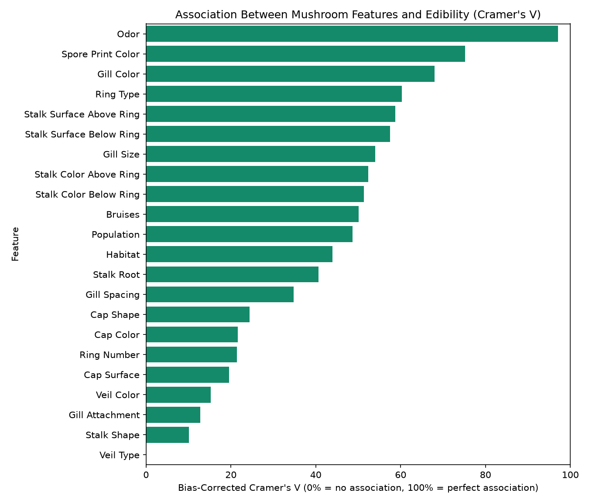
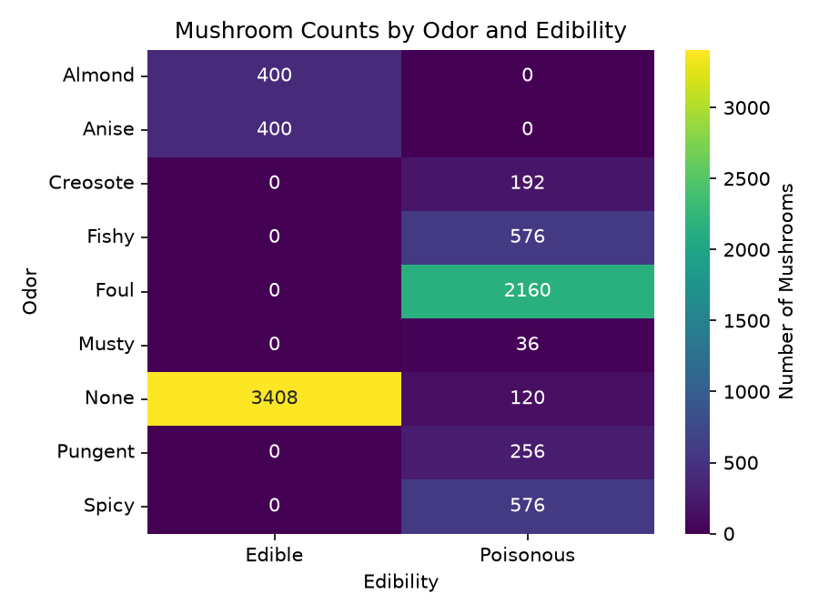
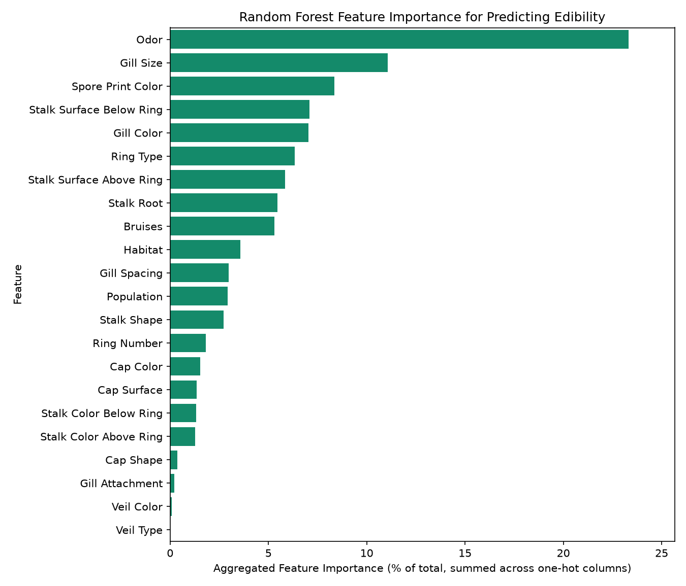
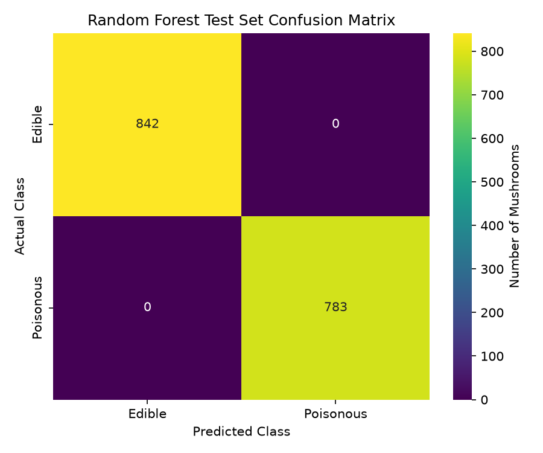
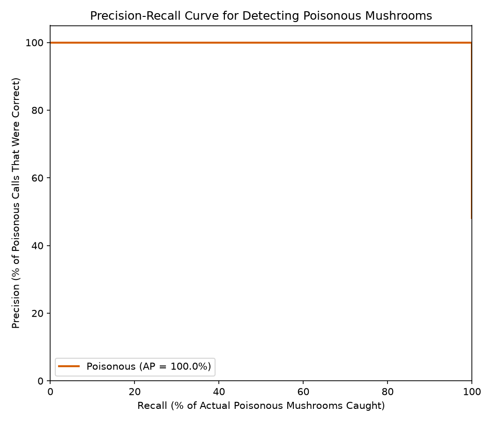
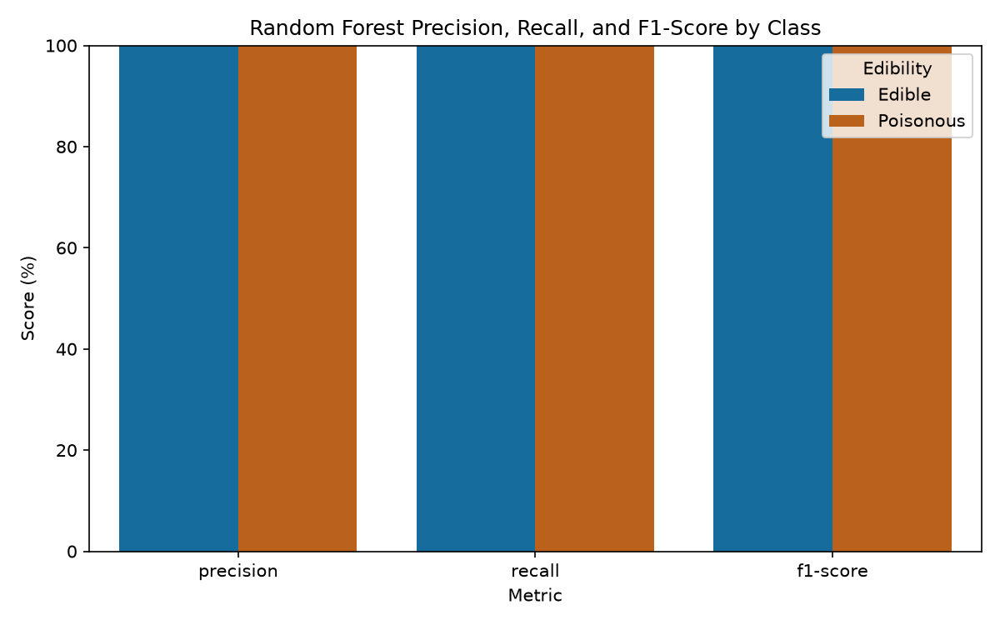

## __Module 10__

### __Name__: Chris Carson, ccarso12\
### __Module Info__: Module 10, Data Dashboard, Due Sunday by 23:59\
### __Installation and Running__:\
Create a virtual environment and activate it\
Install the requirements from requirements.txt\
Place the mushrooms data file in the same location as the python files. It expects a CSV file
in the format of 'mushrooms.csv'.\
Run visualization first, 'python visualization.py'\
Run the dashboard second, 'python dashboard.py'\
The dashboard can then be reached in a browser at http://localhost:8050 or http://127.0.0.1:8050

### __Expected Outputs__:
The visualization.py program will create a total of six charts in .png format: `classification_metrics_by_class`, `confusion_matrix`, `cramers_v_association`, `precision_recall_curve`, `random_forest_feature_importance`, and `top_feature_class_heatmap`. It will additionally create a plotly .html file named `edibility_by_feature`. While running, it will give feedback on where it is in the process as well as some of the data coming in from the analysis.

The dashboard.py program will start-up a flask backed dashboard that can be reached with a browser. The page title (the research question, "Can I determine whether a mushroom will be edible based upon its features?") should be centered at the top, with the explanatory text immediately below it. Sub sections below that should divide the data into three main sections, Exploratory Analysis, Interactive Edibility Breakdown by Feature, and Random Forest Model Results. Each of the charts created by visualization's code should be present within those sections.

### __Approach__:
Originally I had the thought that I might do an analysis that I have been contemplating doing for fun, but never had the time to get to. What are the financial impacts on a business's valuation after reporting a data breach? Doing a quick look, the data is out there, but the number of publicly traded companies that this could be performed on was incredibly limited (in the 50s). Which would really limit the dataset, so I had my wife pick which of the pre-approved options I would do, and she settled on the mushroom question, "Can I determine whether a mushroom will be edible based upon its features?"

I started where I normally do and opened the CSV in Calc to get a feel for what the data I was looking at was like. Partly to get a feel for the data, but to also figure out some of the initial steps I might need to take to clean the dataset before use. The dataset is a large selection of characteristics with values encoded by a single letter. It is well formed, running the cleaning step confirmed all 8,124 rows had recognized values for every characteristic, so no rows needed to be dropped. I limited any additional cleaning to expanding out to the full characteristic, and renaming the column names to title case. While working on this I compared against the value mappings on the Kaggle website and identified that there were several characteristics that mapped to limited options (two or three options) that would likely pose as good check points in the edibility question. This raised the additional question, "What categories are most strongly associated with edibility?" To answer this question and analyze the data further I decided to run a chi-square with Cramer's V (to get a magnitude of significance) on the "class" characteristic (the edibility column) to get an overview, and then to perform a crosstab on the data (which I made the plotly HTML so I could jump between the columns for this analysis). I decided to programmatically select the highest association and create a heatmap on it to get a better idea of what I was looking at.

It became very clear that there were some very strong decision points in the data that could be used to easily make decisions on edibility. The Cramer's V showed incredibly high association on Odor, Spore Print Color, and Gill Color. Each of the individual characteristics in the html were useful in getting an idea of what the spread of poisonous vs. edible plants was by feature. Particularly in the top three items from the Cramer's V chart.

This highly suggests our answer is likely "yes", but we needed go one step further and actually model this and see. Since the program needs to work its way through characteristic-based decisions, I was stuck between a Decision Tree or a Random Forest. Both would work, but Decision Trees tend to overfit when used on datasets with large characteristic quantities. And, maybe more importantly in the context of this assignment, I had never used a Random Forest before and wanted to learn about them.

In order to use either of these models, I needed to convert the characteristic data into something numeric. I considered doing a straight numerical conversion, but I have read that trees can have issues with "random" number assignments to characteristics that might cause the tree to arbitrarily split down a non-existant numerical divide (say, splitting on ">3" which doesn't actually mean anything in this context). I decided on using a one-hot encoding, because it fits well with the tree format and pandas has quick conversion for it. I created this function, then moved to actually setting up the model.

In order to verify the model was functioning, I needed to reserve some of the data for testing, so I split the data into training and testing, sets using train_test_split with the following parameters: keep the same ratio of edible to poisonous in the test set using stratification, use a standard 80/20 split, and use a static random seed for reproducability in future runs of the code.

I then trained the model on the data and ran the test data against it. I printed out text results initially to see how it performed. The results were almost a little too perfect, returning "Correctly predicted 1625 of 1625 test mushrooms (100.00% accuracy)". So I ran an additional five fold test to validate the data and got a consistent return: "5-fold cross-validation accuracy: 1.0000 (+/- 0.0000)". Guess it was accurate.

With the results from the model in place, I proceeded to create charts to show the results. I thought a chart of the feature importance of the model would be a nice comparison against the original analytics we did to see how similar they were. I realized that I needed to recompress the data for this, made some changes to the original code and added a function to accomplish this and then build the chart.

The feature importance chart does a good job showing how accurate our initial analysis was, with the chart matching closely with the shape of the Cramer's V chart. As predicted the Odor played the largest role in the decision tree with Spore Print Color also being important.

Thinking about the dashboard, I also wanted a chart that would demonstrate the successful result of the model, so I also created a heatmap comparing the Success and Fail classifications of the model. The heatmap clearly shows that predictions were perfectly matched, with 0 failures.

Looking at these charts, I wasn't really satisfied that they demonstrated the success rate well, so I created a chart to compare the precision vs recall and it definitely demonstrates the 100%, but isn't particularly impressive (basically just a straight line).

Then I created a bar chart to demonstrate the classification metrics. It clearly shows that the model identifies with high precision and recall, which (with perfect scores) indicates the model can be trusted to predict the difference between edible and poisonous nearly every time. As a blended score of the precision and recall, the F1 would indicate if any of the data was hiding results. In this case, the score would indicate that there is nothing odd in the scores that would raise suspicion. From a purely aesthetic perspective, it is also just a bunch of full bars. I'm actually at a loss at what else could be charted to demonstrate the success rate that has more... punch? I guess not all dashboards have to be glamorous.

I made another pass of the code to clean it up some and remove any testing code. I noticed the HTML file was a little on the hefty side, so I manipulated it to import the code instead of including it in the file itself. This brought the file size down to something far more manageable.

I moved on to the dashboard. As with flask and making charts, a lot of this process is setting up the presentation. I created the title and intro first, then divided the charts into subsections roughly divided by my process (Exploratory/Model Results). I focused on the individual chart inclusion first and realized that I needed to modify the plotly export to include that particular chart, so I went back to visualization.py and split the image generation part out from the html save portion and then imported the pieces of visualization that I needed to recreate the chart in Dash.

I then put all of the parts together to generate the dashboard. I checked to validate dashboard was serving the page properly. I noticed Dash runs on 8050 and I considered changing it to 8080 to coincide with our previous modules, but it wasn't specifically mentioned as needing to be changed, so I left it as is. I then did another pass of the code to clean it up. I then ran it again and took two screenshots of the running dashboard, since it wouldn't all fit in one screen and saved them as dashboard.png and dashboard2.png.

### __Analysis__:
After modeling the various characteristics, the model was capable of predicting poisonous from edible 100% of the time. The direct answer to the question is, Yes, it is possible to identify if a mushroom will be edible based on its characteristics. However, "Would I trust the model to identify mushrooms for me?" is an entirely different question this analysis is not equipped to answer.

### __References__:
Garrido, J. M. (2016). Introduction to computational models with Python. CRC Press.

Tuckfield, B. (2023). Dive into data science: Use Python to tackle your toughest business
challenges. No Starch Press.

Schroeder, A., Mayer, C., & Ward, A. M. (2022). The book of Dash: Build dashboards with Python
and Plotly. No Starch Press.

UCI Machine Learning [uciml]. (n.d.). Mushroom classification [Data set]. Kaggle. https://www.kaggle.com/datasets/uciml/mushroom-classification