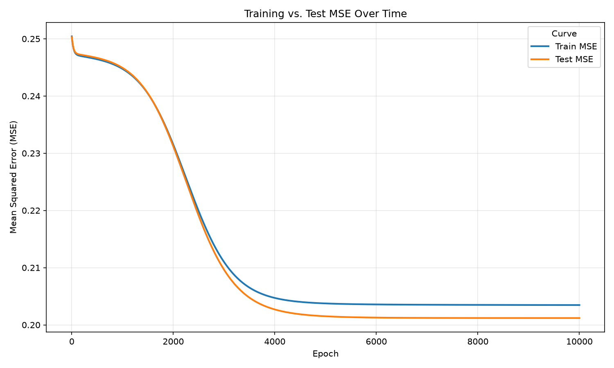

## __Module 12__

### __Name__: Chris Carson, ccarso12\
### __Module Info__: Module 12, Two-Layer Neural Network, Due 2 Aug 2026\

### __Files__:
gradcafe_module12_input.jsonl
mse_curve.png
neural_network.py
README.md
requirements.txt
training.log
writeup.pdf

### __Installation and Running__:\
Create a virtual environment and activate it\
Install the requirements from requirements.txt\
Place `gradcafe_module12_input.jsonl` in the same location as the python files. It expects a JSON Lines file (one JSON object per line) with the fields `gpa`, `gre`, `gre_v`, `gre_aw`, `masters_or_phd`, `citizenship`, and `applicant_status`.\
Run the neural network: `python neural_network.py`\
The program takes under a minute to run to completion.

### __Expected Outputs__:
The neural_network.py program prints its progress to the console/log at every stage: dataset filtering counts, training/test split sizes and preprocessing statistics, training printouts every 100 epochs, final evaluation results, and artificial applicant predictions. It then produces the `mse_curve.png` chart.

### __Approach__:
I re-used the cleaned GradCafe dataset from earlier, but my first task was actually a data-format question. My existing dataset didn't match the JSON Lines schema this assignment expects. Following from guidance in previous modules I reshaped the data to match the assignment's stated requirements (and reduced the extra noise columns to reduce the data file size). I wrote a small standalone converter to accomplish this and moved on with the assignment.

Proceeeding to Step 1, I filtered to Accepted/Rejected outcomes and Masters/PhD degrees, converted the numeric fields from strings to floats, and built the three engineered features (`ms_vs_phd`, `international_vs_local`, `target`). While inspecting the converted data I noticed the data still contained some out of bounds data entries. If left, they would distort the mean/standard deviation used later for standardization. I added a bounds check that treats `gre`/`gre_v` outside 130-170 and `gre_aw` outside 0-6 as missing, so they get median-filled like any other missing value instead of skewing the statistics. Everything looked good at this point, so I moved on.

Step 2 splits the data 80/20 with `train_test_split(test_size=0.2, random_state=42, shuffle=True)`. I considered adding the stratify command to the split to force the ratios to match (since it was indicated this was super important for the assignment), but the split was already pretty close when I ran it, so I opted to keep the exact specifications in the assignment. I then filled and standardized both sets using statistics computed from the training set only, to avoid leaking test-set information into preprocessing. I built the median-fill and standardization logic as two small reusable functions, anticipating the need for the exact same preprocessing again later for the artificial applicants.

Step 3 implements the `TwoLayerNet` class (6 inputs -> 6 hidden units with sigmoid -> 1 output with sigmoid), with weights drawn from a Normal(0, 0.1) distribution and biases at zero. I derived the backpropagation gradients starting from the MSE loss and chaining through each sigmoid, then implemented `forward()`, `backward()`, `predict_proba()`, and `predict()`.

Step 4 trains the network with full-batch gradient descent for up to 10,000 epochs. I added tracking of the training MSE, test MSE, and test accuracy (threshold 0.5) every epoch, with early stopping if test MSE did not improved for 100 consecutive epochs (restoring the best-epoch parameters before
final evaluation). In practice, the test MSE kept improving by tiny amounts all the way through epoch 10,000, so early stopping never actually triggered on this run, it simply hit the epoch cap. Analysis below.

For Step 5, I printed the collected results from Step 4. Analysis is below.

Step 6 I plotted training vs. test MSE over time and saved it as `mse_curve.png`.

For Step 7 (the artificial applicants), I built four applicants instead of the minimum two, since I wanted to see the model's behavior split cleanly by degree type: a "strong profile" and "weaker profile" applicant for both PhD and Masters. I ran these new applicants through the same pipeline as the input data. Analysis also below.

### __Analysis__:
**Training log** (Full log below and in training.log):

```
Epoch 100/10000  - Train MSE: 0.247231, Test MSE: 0.247419, Test Acc: 0.5509
Epoch 500/10000  - Train MSE: 0.246423, Test MSE: 0.246659, Test Acc: 0.5509
Epoch 1000/10000 - Train MSE: 0.244739, Test MSE: 0.244922, Test Acc: 0.5509
Epoch 1900/10000 - Train MSE: 0.233650, Test MSE: 0.233424, Test Acc: 0.5561
Epoch 2000/10000 - Train MSE: 0.231502, Test MSE: 0.231192, Test Acc: 0.6620
Epoch 2100/10000 - Train MSE: 0.229228, Test MSE: 0.228825, Test Acc: 0.7157
Epoch 2300/10000 - Train MSE: 0.224497, Test MSE: 0.223892, Test Acc: 0.7184
Epoch 3000/10000 - Train MSE: 0.210988, Test MSE: 0.209635, Test Acc: 0.7187
Epoch 5000/10000 - Train MSE: 0.203749, Test MSE: 0.201505, Test Acc: 0.7187
Epoch 8000/10000 - Train MSE: 0.203494, Test MSE: 0.201201, Test Acc: 0.7184
Epoch 10000/10000 - Train MSE: 0.203465, Test MSE: 0.201197, Test Acc: 0.7184
```

There was a sharp accuracy jump between epochs 1,900 and 2,300 (from ~0.556 to ~0.718). This is the point where the network's weights moved past a plateau and started separating the two classes meaningfully. After that point, MSE continued to improve only very slowly for the remaining ~7,700 epochs.



**Final evaluation** (Step 5):

```
Rows used after filtering: 38889
Train size: 31111
Test Size: 7778
Best Epoch: 10000
Best test MSE: 0.201197
Final train accuracy: 0.7138
Final test accuracy: 0.7184
```

Final training accuracy (0.7138) and final test accuracy (0.7184) are close to one another and training/test MSE tracked each other closely throughout, rather than diverging. This shows no sign of overfitting.

The majority-class baseline (always predicting "Rejected") is about 55.1% on the test set. A final test accuracy of ~71.8% is roughly 16.7 percentage points above that baseline -- a meaningful, not marginal, improvement, and one that appears stable rather than unstable, since MSE and accuracy moved smoothly across epochs with no large swings.

Six features (GPA, three GRE scores, degree type, and citizenship) leave out most of what actually drives a real admissions decision -- program or department, research fit, letters of recommendation, statement of purpose, prior publications, and program-specific competitiveness, none of which are present here. A large share of GPA/GRE values were also missing (and had to be median-filled), or worse, contained values that were completely out of bounds. So while this feature set clearly carries genuine signal (clearing the baseline by 16+ points), it is not sufficient on its own for a realistic, high-confidence admissions predictor.

**Artificial applicant predictions** (Step 7):

| Applicant | GPA | GRE | GRE-V | GRE-AW | Degree | Citizenship | Predicted Probability | Predicted Status |
|---|---|---|---|---|---|---|---|---|
| Strong profile | 3.90 | 168 | 165 | 5.0 | PhD | International | 0.3038 | Rejected |
| Weaker profile | 3.30 | 150 | 148 | 3.5 | PhD | Local | 0.2869 | Rejected |
| Strong profile | 3.85 | 165 | 162 | 4.5 | Masters | International | 0.7441 | Accepted |
| Weaker profile | 3.20 | 148 | 145 | 3.0 | Masters | Local | 0.6946 | Accepted |

Both PhD applicants (strong and weaker profile) are predicted Rejected (~0.30 and ~0.29 probability), while both Masters applicants are predicted Accepted (~0.74 and ~0.69 probability). Within each degree type the strong-profile applicant does get a somewhat higher predicted probability than the weaker-profile one, so GPA/GRE are having some effect -- but that effect is small compared to the gap between PhD and Masters applicants. In other words, `ms_vs_phd` appears to be the dominant driver of these four predictions, with the numeric features acting more as a secondary adjustment than a primary driver. Whether that reflects a genuine pattern in the real GradCafe data (PhD programs being more competitive/selective than Masters programs, for instance) or the network leaning on the single strongest, cleanest, always-present binary feature instead of the noisier, heavily-missing numeric ones, is an interesting question that has no immediate answer.


### __References__:
Fenner, M. E. (2020). Machine learning with Python for everyone. Pearson Education, Inc.

### __Training Log__:
--- Training ---

Epoch 100/10000 - Train MSE: 0.247231, Test MSE: 0.247419, Test Acc: 0.5509
Epoch 200/10000 - Train MSE: 0.246947, Test MSE: 0.247182, Test Acc: 0.5509
Epoch 300/10000 - Train MSE: 0.246786, Test MSE: 0.247027, Test Acc: 0.5509
Epoch 400/10000 - Train MSE: 0.246616, Test MSE: 0.246856, Test Acc: 0.5509
Epoch 500/10000 - Train MSE: 0.246423, Test MSE: 0.246659, Test Acc: 0.5509
Epoch 600/10000 - Train MSE: 0.246199, Test MSE: 0.246428, Test Acc: 0.5509
Epoch 700/10000 - Train MSE: 0.245931, Test MSE: 0.246153, Test Acc: 0.5509
Epoch 800/10000 - Train MSE: 0.245608, Test MSE: 0.245820, Test Acc: 0.5509
Epoch 900/10000 - Train MSE: 0.245216, Test MSE: 0.245415, Test Acc: 0.5509
Epoch 1000/10000 - Train MSE: 0.244739, Test MSE: 0.244922, Test Acc: 0.5509
Epoch 1100/10000 - Train MSE: 0.244159, Test MSE: 0.244322, Test Acc: 0.5509
Epoch 1200/10000 - Train MSE: 0.243457, Test MSE: 0.243595, Test Acc: 0.5509
Epoch 1300/10000 - Train MSE: 0.242611, Test MSE: 0.242719, Test Acc: 0.5509
Epoch 1400/10000 - Train MSE: 0.241601, Test MSE: 0.241674, Test Acc: 0.5509
Epoch 1500/10000 - Train MSE: 0.240410, Test MSE: 0.240439, Test Acc: 0.5509
Epoch 1600/10000 - Train MSE: 0.239021, Test MSE: 0.238999, Test Acc: 0.5508
Epoch 1700/10000 - Train MSE: 0.237429, Test MSE: 0.237348, Test Acc: 0.5512
Epoch 1800/10000 - Train MSE: 0.235634, Test MSE: 0.235485, Test Acc: 0.5517
Epoch 1900/10000 - Train MSE: 0.233650, Test MSE: 0.233424, Test Acc: 0.5561
Epoch 2000/10000 - Train MSE: 0.231502, Test MSE: 0.231192, Test Acc: 0.6620
Epoch 2100/10000 - Train MSE: 0.229228, Test MSE: 0.228825, Test Acc: 0.7157
Epoch 2200/10000 - Train MSE: 0.226875, Test MSE: 0.226374, Test Acc: 0.7178
Epoch 2300/10000 - Train MSE: 0.224497, Test MSE: 0.223892, Test Acc: 0.7184
Epoch 2400/10000 - Train MSE: 0.222150, Test MSE: 0.221436, Test Acc: 0.7184
Epoch 2500/10000 - Train MSE: 0.219886, Test MSE: 0.219061, Test Acc: 0.7184
Epoch 2600/10000 - Train MSE: 0.217748, Test MSE: 0.216814, Test Acc: 0.7184
Epoch 2700/10000 - Train MSE: 0.215773, Test MSE: 0.214729, Test Acc: 0.7183
Epoch 2800/10000 - Train MSE: 0.213982, Test MSE: 0.212831, Test Acc: 0.7183
Epoch 2900/10000 - Train MSE: 0.212387, Test MSE: 0.211133, Test Acc: 0.7187
Epoch 3000/10000 - Train MSE: 0.210988, Test MSE: 0.209635, Test Acc: 0.7187
Epoch 3100/10000 - Train MSE: 0.209778, Test MSE: 0.208332, Test Acc: 0.7187
Epoch 3200/10000 - Train MSE: 0.208743, Test MSE: 0.207210, Test Acc: 0.7187
Epoch 3300/10000 - Train MSE: 0.207866, Test MSE: 0.206252, Test Acc: 0.7187
Epoch 3400/10000 - Train MSE: 0.207130, Test MSE: 0.205441, Test Acc: 0.7187
Epoch 3500/10000 - Train MSE: 0.206515, Test MSE: 0.204758, Test Acc: 0.7187
Epoch 3600/10000 - Train MSE: 0.206004, Test MSE: 0.204185, Test Acc: 0.7187
Epoch 3700/10000 - Train MSE: 0.205582, Test MSE: 0.203706, Test Acc: 0.7187
Epoch 3800/10000 - Train MSE: 0.205233, Test MSE: 0.203306, Test Acc: 0.7187
Epoch 3900/10000 - Train MSE: 0.204945, Test MSE: 0.202973, Test Acc: 0.7187
Epoch 4000/10000 - Train MSE: 0.204708, Test MSE: 0.202694, Test Acc: 0.7187
Epoch 4100/10000 - Train MSE: 0.204513, Test MSE: 0.202462, Test Acc: 0.7187
Epoch 4200/10000 - Train MSE: 0.204353, Test MSE: 0.202269, Test Acc: 0.7187
Epoch 4300/10000 - Train MSE: 0.204220, Test MSE: 0.202107, Test Acc: 0.7187
Epoch 4400/10000 - Train MSE: 0.204111, Test MSE: 0.201971, Test Acc: 0.7187
Epoch 4500/10000 - Train MSE: 0.204020, Test MSE: 0.201857, Test Acc: 0.7187
Epoch 4600/10000 - Train MSE: 0.203945, Test MSE: 0.201761, Test Acc: 0.7187
Epoch 4700/10000 - Train MSE: 0.203882, Test MSE: 0.201680, Test Acc: 0.7187
Epoch 4800/10000 - Train MSE: 0.203830, Test MSE: 0.201612, Test Acc: 0.7187
Epoch 4900/10000 - Train MSE: 0.203786, Test MSE: 0.201554, Test Acc: 0.7187
Epoch 5000/10000 - Train MSE: 0.203749, Test MSE: 0.201505, Test Acc: 0.7187
Epoch 5100/10000 - Train MSE: 0.203717, Test MSE: 0.201463, Test Acc: 0.7187
Epoch 5200/10000 - Train MSE: 0.203691, Test MSE: 0.201427, Test Acc: 0.7187
Epoch 5300/10000 - Train MSE: 0.203668, Test MSE: 0.201396, Test Acc: 0.7187
Epoch 5400/10000 - Train MSE: 0.203648, Test MSE: 0.201369, Test Acc: 0.7187
Epoch 5500/10000 - Train MSE: 0.203631, Test MSE: 0.201347, Test Acc: 0.7187
Epoch 5600/10000 - Train MSE: 0.203617, Test MSE: 0.201327, Test Acc: 0.7187
Epoch 5700/10000 - Train MSE: 0.203604, Test MSE: 0.201310, Test Acc: 0.7187
Epoch 5800/10000 - Train MSE: 0.203592, Test MSE: 0.201295, Test Acc: 0.7187
Epoch 5900/10000 - Train MSE: 0.203582, Test MSE: 0.201283, Test Acc: 0.7187
Epoch 6000/10000 - Train MSE: 0.203573, Test MSE: 0.201271, Test Acc: 0.7187
Epoch 6100/10000 - Train MSE: 0.203565, Test MSE: 0.201262, Test Acc: 0.7187
Epoch 6200/10000 - Train MSE: 0.203558, Test MSE: 0.201253, Test Acc: 0.7187
Epoch 6300/10000 - Train MSE: 0.203552, Test MSE: 0.201246, Test Acc: 0.7187
Epoch 6400/10000 - Train MSE: 0.203546, Test MSE: 0.201240, Test Acc: 0.7187
Epoch 6500/10000 - Train MSE: 0.203541, Test MSE: 0.201234, Test Acc: 0.7186
Epoch 6600/10000 - Train MSE: 0.203536, Test MSE: 0.201229, Test Acc: 0.7186
Epoch 6700/10000 - Train MSE: 0.203531, Test MSE: 0.201225, Test Acc: 0.7186
Epoch 6800/10000 - Train MSE: 0.203527, Test MSE: 0.201221, Test Acc: 0.7186
Epoch 6900/10000 - Train MSE: 0.203523, Test MSE: 0.201218, Test Acc: 0.7187
Epoch 7000/10000 - Train MSE: 0.203520, Test MSE: 0.201215, Test Acc: 0.7187
Epoch 7100/10000 - Train MSE: 0.203516, Test MSE: 0.201213, Test Acc: 0.7187
Epoch 7200/10000 - Train MSE: 0.203513, Test MSE: 0.201211, Test Acc: 0.7187
Epoch 7300/10000 - Train MSE: 0.203510, Test MSE: 0.201209, Test Acc: 0.7187
Epoch 7400/10000 - Train MSE: 0.203507, Test MSE: 0.201207, Test Acc: 0.7187
Epoch 7500/10000 - Train MSE: 0.203505, Test MSE: 0.201206, Test Acc: 0.7187
Epoch 7600/10000 - Train MSE: 0.203502, Test MSE: 0.201205, Test Acc: 0.7184
Epoch 7700/10000 - Train MSE: 0.203500, Test MSE: 0.201204, Test Acc: 0.7184
Epoch 7800/10000 - Train MSE: 0.203498, Test MSE: 0.201203, Test Acc: 0.7184
Epoch 7900/10000 - Train MSE: 0.203496, Test MSE: 0.201202, Test Acc: 0.7184
Epoch 8000/10000 - Train MSE: 0.203494, Test MSE: 0.201201, Test Acc: 0.7184
Epoch 8100/10000 - Train MSE: 0.203492, Test MSE: 0.201201, Test Acc: 0.7184
Epoch 8200/10000 - Train MSE: 0.203490, Test MSE: 0.201200, Test Acc: 0.7184
Epoch 8300/10000 - Train MSE: 0.203488, Test MSE: 0.201200, Test Acc: 0.7184
Epoch 8400/10000 - Train MSE: 0.203486, Test MSE: 0.201200, Test Acc: 0.7184
Epoch 8500/10000 - Train MSE: 0.203485, Test MSE: 0.201199, Test Acc: 0.7184
Epoch 8600/10000 - Train MSE: 0.203483, Test MSE: 0.201199, Test Acc: 0.7184
Epoch 8700/10000 - Train MSE: 0.203482, Test MSE: 0.201199, Test Acc: 0.7184
Epoch 8800/10000 - Train MSE: 0.203480, Test MSE: 0.201198, Test Acc: 0.7184
Epoch 8900/10000 - Train MSE: 0.203479, Test MSE: 0.201198, Test Acc: 0.7184
Epoch 9000/10000 - Train MSE: 0.203477, Test MSE: 0.201198, Test Acc: 0.7184
Epoch 9100/10000 - Train MSE: 0.203476, Test MSE: 0.201198, Test Acc: 0.7184
Epoch 9200/10000 - Train MSE: 0.203475, Test MSE: 0.201198, Test Acc: 0.7184
Epoch 9300/10000 - Train MSE: 0.203473, Test MSE: 0.201198, Test Acc: 0.7184
Epoch 9400/10000 - Train MSE: 0.203472, Test MSE: 0.201198, Test Acc: 0.7184
Epoch 9500/10000 - Train MSE: 0.203471, Test MSE: 0.201197, Test Acc: 0.7184
Epoch 9600/10000 - Train MSE: 0.203470, Test MSE: 0.201197, Test Acc: 0.7184
Epoch 9700/10000 - Train MSE: 0.203468, Test MSE: 0.201197, Test Acc: 0.7184
Epoch 9800/10000 - Train MSE: 0.203467, Test MSE: 0.201197, Test Acc: 0.7184
Epoch 9900/10000 - Train MSE: 0.203466, Test MSE: 0.201197, Test Acc: 0.7184
Epoch 10000/10000 - Train MSE: 0.203465, Test MSE: 0.201197, Test Acc: 0.7184

Best epoch: 10000
Best test MSE: 0.201197